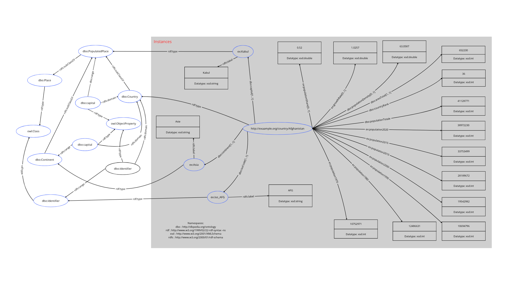
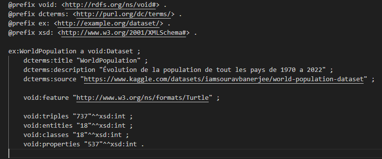

# Projet_RDF_WorldPopulation
Projet - M1ALMA / M1ATAL - Web Semantic - L’objectif du projet est de transformer les données ouvertes de votre choix en données sémantiques et de lier ses données sémantiques au cloud de “Linked Data : Connect Distributed Data across the Web”1

# Projet : Transformation de données ouvertes en données sémantiques

## Objectif du projet

L’objectif de ce projet est de transformer des **données ouvertes** de votre choix en **données sémantiques** et de lier ces données sémantiques au cloud de **Linked Data**, afin de **connecter des données distribuées à travers le Web**.

Pour ce projet, nous avons choisi d’utiliser le **jeu de données “World Population Dataset”** disponible sur Kaggle :
[World Population Dataset](https://www.kaggle.com/datasets/iamsouravbanerjee/world-population-dataset)

Les outils utilisés sont :

* **OpenRefine** pour le nettoyage, la transformation et le typage des données.
* **Apache Jena Fuseki** pour l’hébergement et l’interrogation des données sémantiques via SPARQL.

---

## Installation et utilisation

### 1. OpenRefine

OpenRefine est un outil open source pour nettoyer et transformer les données.

**Installation :**

1. Télécharger OpenRefine depuis : [https://openrefine.org/download.html](https://openrefine.org/download.html) et l'extension [OpenRefine RDF Extension](https://github.com/stkenny/grefine-rdf-extension)
2. Extraire le fichier téléchargé.
3. Lancer OpenRefine :

   * Sur Windows : exécuter `openrefine.exe`
   * Sur Mac/Linux : exécuter `./refine` depuis le terminal
4. Ouvrir OpenRefine dans un navigateur à l’adresse : `http://127.0.0.1:3333/`

**Utilisation pour ce projet :**

* Importer le fichier CSV du jeu de données.
* Nettoyer les données (suppression des espaces, valeurs manquantes, harmonisation).
* Définir les types des colonnes (integer, string, date, boolean, decimal).
* Exporter les données transformées au format **RDF / Turtle** pour l’utiliser dans Fuseki.

### 2. Apache Jena Fuseki

Fuseki est un serveur pour publier et interroger des données RDF avec SPARQL.

**Installation :**

1. Télécharger Fuseki depuis : [https://jena.apache.org/download/index.cgi](https://jena.apache.org/download/index.cgi)
2. Extraire le fichier et lancer le serveur :

   ```bash
   ./fuseki-server
   ```
3. Ouvrir l’interface web de Fuseki : [http://localhost:3030/](http://localhost:3030/)
4. Créer un dataset et importer le fichier RDF exporté depuis OpenRefine.

**Utilisation :**

* Interroger vos données avec des Query SPARQL via OpenRefine.
* Publier les données sur le cloud pour les connecter avec d’autres données Linked Data.

### 3. Obtention du fichier CSV

Le jeu de données **World Population Dataset** peut être téléchargé depuis Kaggle :
[https://www.kaggle.com/datasets/iamsouravbanerjee/world-population-dataset](https://www.kaggle.com/datasets/iamsouravbanerjee/world-population-dataset)


### 4. Présentation des données

Vous allez trouver un graphe sur l'objet qui représente le pays Afghanistan.



### 5. Utiliser nos données

* Vous pouvez faire des requêtes sur notre graphe à l'adresse :
https://api.triplydb.com/Asserche/worldPopulation/sparql
* Et vous pouvez accéder au graphe à l'adresse :
https://triplydb.com/Asserche/worldPopulation/sparql

### 6. Utiliser les ontologies RDFS/OWL
Pour avoir accès aux ontologies dans Fuseki, il faut modifier le fichier de configuration. 
Vous pouvez trouver un exemple de fichier de configuration de fuseki qui permet les inférences dans le dossier "./fuseki/config". 
Il vous suffit ensuite d'executer la commande fuseki avec config=[path vers le fichier]

### 7. Liaison au Cloud Linked Data
Pour réaliser la liaison de notre dataset au Web de données liées, nous avons enrichi notre modèle avec deux types de liens externes : le owl:sameAs et le skos:exactMatch

### 8. Déscription VOID


---
## Réalisation du projet

Ce projet a été réalisé par :

* Arthur Chevreux
* Ewen Hamono
* Cheikh Tidiane DIOP
* Christopher Chiaberge

